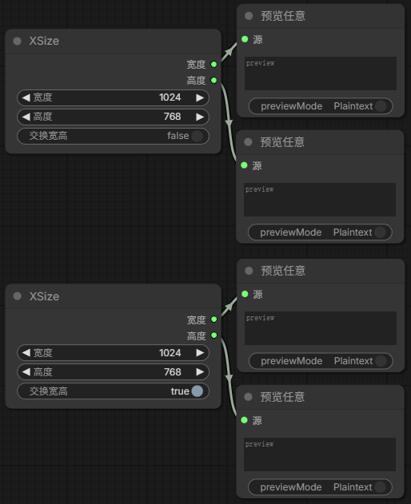
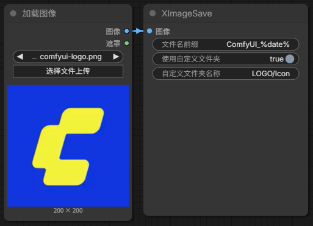
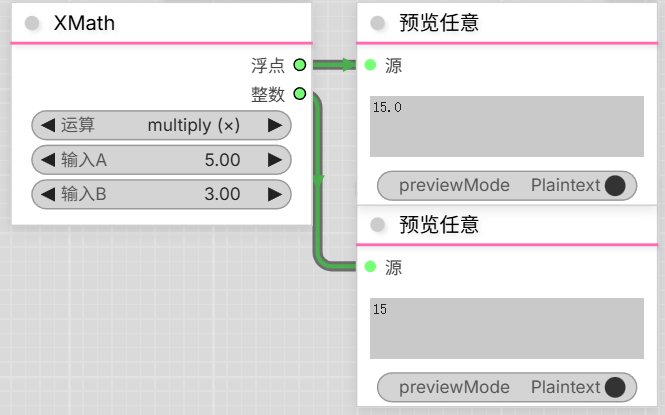

# ComfyUI Xz3r0 Nodes

# [注意]本库中的节点都处于早期测试阶段,节点会因为我的想法或需求进行(大量)更改.
# [Warning]All nodes are in the early testing stage, and the nodes will be (significantly) changed based on my ideas or needs.

The node has [Chinese/English] localization

节点拥有[中/英]本地化

一些我自己的时尚小垃圾节点(似乎又重复造轮子了)

全程面向Vibe Coding

## 安装
```bash
git clone https://github.com/Xz3r0-M/ComfyUI-Xz3r0-Node.git
cd ComfyUI-Xz3r0-Node
pip install -r requirements.txt
```

## 节点列表
### XSize (分辨率设置节点)
- 设置宽度和高度的值
- 交换宽高值开关。



### XImageSave (图像保存节点)
- 支持文件名标识符
  - `%date%` - 日期 (YYYY-MM-DD格式)
  - `%time%` - 时间 (HH-MM-SS格式)
  - `%Y%`, `%m%`, `%d%` - 年、月、日
  - `%H%`, `%M%`, `%S%` - 时、分、秒
  - `%timestamp%` - Unix时间戳
  - `%seed%` - (来自)采样器输出的种子值
- 包含开关可选择是否使用(默认输出目录下)自定义文件夹来保存图像
- 不存在的自定义文件夹将会自动创建（支持同时创建多级子文件夹,如: 默认输出目录/人物/女性）
- 可选择为自定义文件夹名自动添加序列号，避免重复命名（例如：图片_00001）




### XSaveLatent (Latent保存节点)
- 将`.latent`文件保存到ComfyUI的Output目录
- 可以为文件名添加序列号（防止覆盖）
- 将已保存的路径+文件名输出为字符串
- 保存和单独加载Latent可以让工作流中的采样器与VAE解码分开处理,节省硬件资源.

### XLoadLatent (Latent加载节点)
- 从ComfyUI的Output目录中加载`.latent`文件
- 提供下拉列表显示Output目录及其子目录中的Latent文件
- 支持手动输入路径（优先）：可以直接接收来自XSaveLatent节点的路径+文件名，优先于下拉列表选择


### XMath (数学计算节点)
- 支持整数和浮点数的数学运算
- 支持多种运算类型：加法(+)、减法(-)、乘法(×)、除法(÷)、幂运算(^)、取模(%)、整除(//)、百分比(%)、最小值、最大值
- 同时输出浮点数和整数结果



### XVideoSave (无损视频保存节点)
- 调用FFmpeg将图像序列保存为无损视频
- 视频参数(为了节点简洁只有FPS可以修改,其余参数均为硬编码在节点里)：
  - FPS（视频每秒帧数）
  - 编码格式：H.265/HEVC
  - 容器格式：MKV
  - 像素格式：yuv444p10le
  - 预设：fast（编码速度与压缩率的平衡）
  - 质量：CRF=0（绝对无损）
- 支持文件名标识符（与XImageSave节点相同）
  - `%date%` - 日期 (YYYY-MM-DD格式)
  - `%time%` - 时间 (HH-MM-SS格式)
  - `%Y%`, `%m%`, `%d%` - 年、月、日
  - `%H%`, `%M%`, `%S%` - 时、分、秒
  - `%timestamp%` - Unix时间戳
  - `%seed%` - (来自)采样器输出的种子值
- 包含开关可选择是否使用(默认输出目录下)自定义文件夹来保存视频
- 不存在的自定义文件夹将会自动创建（支持同时创建多级子文件夹,如: 默认输出目录/视频/动画）
- 优先调用系统安装的FFmpeg，如未找到则使用Python的FFmpeg库作为备选方案
- 将已保存的视频路径输出为字符串
